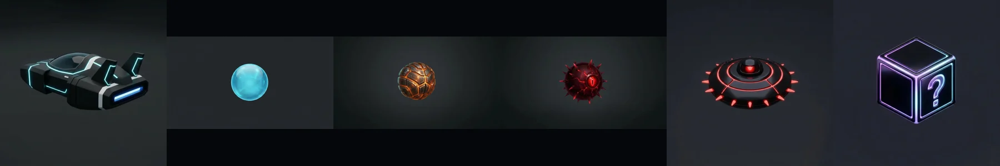
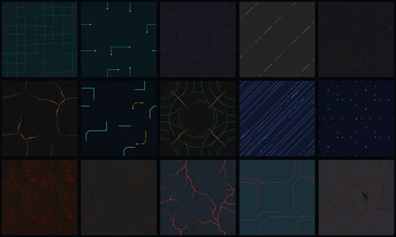
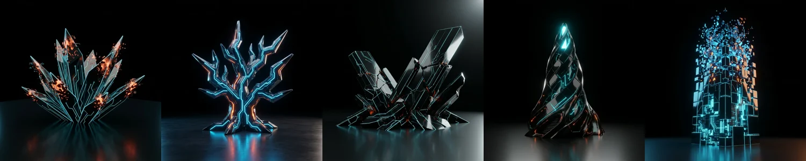
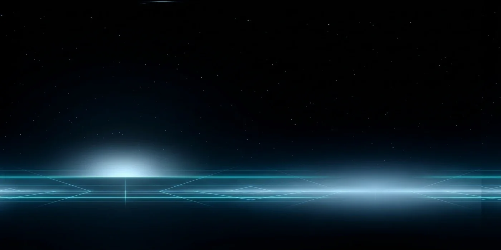

# TRON: EXONIX

**A childhood game rebuilt from memory — by describing it to an AI agent.**

EXONIX is a love letter to [AirXonix](https://en.wikipedia.org/wiki/AirXonix) (2001), the game I played to death as a kid, reimagined in a TRON-style neon world. You pilot a light-craft over a dark energy sea, carve territory out of it line by line, and try to claim the sector before the things living in the sea get to you.

The twist: **I didn't write the code.** The entire game — logic, shaders, VFX, UI, balancing — was built by Claude (Anthropic's coding agent) working inside my toolchain, while I played art director and game designer: play, give feedback, confirm materials in Blender, repeat.



## The setup

| Tool | Role |
|---|---|
| **Claude Code** | The builder. Wrote all GDScript, shaders, and pipelines; ran and debugged the game in a loop |
| **Godot 4.7** | Engine (Forward+). The whole scene is built in code — one `.tscn`, everything else is scripts |
| **Godot MCP** | Let the agent run the game, read debug output, and iterate without me touching the editor |
| **Blender MCP** | Material review loop: the agent set up preview scenes, I tuned roughness/metallic/emission by hand, it mirrored my exact values back into the game shaders |
| **fal.ai** (Nano Banana + PATINA + Stable Audio + ElevenLabs) | All floor texture sets (flat albedo → PBR + emission), the night-sky HDRI panorama the floors reflect, all music and SFX |
| **Tripo** | Image-to-3D for the saw, the pickups and the five obstacle monuments |

Workflow was strictly **commit → review → adjust**: the agent ships a working build with reasonable defaults, I play it and react, it tunes. No design documents — the game grew out of ~three days of that loop.


*The floor palette: five CAPTURED sets, five CORRUPTED (enemy-territory) sets, five UNCAPTURED seas — generated flat albedo → PBR, hand-tuned in Blender, assigned per sector.*

## Mechanics

Classic Xonix core, then it escalates:

- **Cut & capture** — leave the safe rim, draw a trail through the sea, close it back on claimed land. Every enclosed region that contains no enemy becomes yours. Reach the sector's coverage threshold to win.
- **The burn** — an enemy touching your unfinished trail doesn't kill you instantly: the line *catches fire* and burns toward you from the hit point at 1.5× your speed. Outrun it to land and the surviving line still captures.
- **The bestiary**
  - *Soft balls* — bounce around the sea; blocked by everything. Speed variants wear their outline: orange = +15%, red = +30%.
  - *Hard balls* — 1.3× bigger, smash bites out of your platform (the hole widens until they fit). Red-outlined mediums run +50%.
  - *Evil balls* — lazy homing missiles that hunt you personally.
  - *Mines* — patrol your claimed ground, so the "safe" side never is.
  - *Hunter mines* — redder, slower, and they ignore the surface entirely: they just fly at you. Only an obstacle stops one — mutual destruction.
  - *The SAW* — a spinning disc that carves straight lines through **captured** territory, undoing your work. Territory containing the saw can't be captured.
  - *Obstacles* — "natural cataclysms" of the grid (corrupted bloom, static tree, grid rift, singularity spire, de-rez storm) rising from the ground; destroyed by 3 ball hits.


- **Pickups** — bonuses (blue), debuffs (red), and the ever-tempting violet `?` surprise (65% bad / 35% good). They drop on land *and* sea; enemies can detonate them before you get there. The endgame is generous: under 20 seconds drops accelerate, and the clock bonus gets 4× more likely.
- **Ultimates** — *ZA WARUDO* (all enemies crawl at 10% for 8s) and *BALLMAGEDDON* (every ball on the field splits at once, 8s). Rare jackpots — the surprise box announces them loudly.
- **10 sectors** — growing arenas (60×60 → 90×90), each individually designed: textures, loadout, hazards and an explicit coverage requirement per sector. From sector 3, pre-claimed islands spawn at random so no two runs start alike.
- **Per-level leaderboards** — remaining time banks 1000 points per second into your score on clear; boards rank by score (name · score · coverage · date), stored locally as a top-10 per sector.


*Even the sky is generated: a cold TRON night panorama, converted to real HDR — it's what the polished floors mirror.*

## Running it

1. Install [Godot 4.7](https://godotengine.org/download) (standard build, no C#).
2. Open `game/project.godot` and hit **F5** — or edit `game/play.bat` to point at your Godot exe and double-click it.

Arrows to move, SPACE to launch, ESC for menu. Keys 1–7 jump straight to any sector (debug leftover, enjoy).

All textures and models load at runtime from `assets/` — no import step, what's in the repo is what runs.

## Repo layout

```
game/               Godot project (main3d.tscn + scripts/)
  scripts/          qix_config.gd = every tuning knob; the rest is modular game logic
  ARCHITECTURE.md   how the code is organized, for humans and agents
assets/
  textures/         PBR floor sets (fal.ai pipeline) + generation scripts
  3d/               GLB models (hero, enemies, pickups, saw, obstacles)
  audio/            SFX + music (fal.ai generated)
```

The `gen_*.py` scripts scattered through `assets/` are the actual asset pipelines the agent wrote and ran — kept as part of the story.

---

*Unofficial fan homage. TRON is a trademark of Disney; AirXonix belongs to its authors. This project is non-commercial.*
